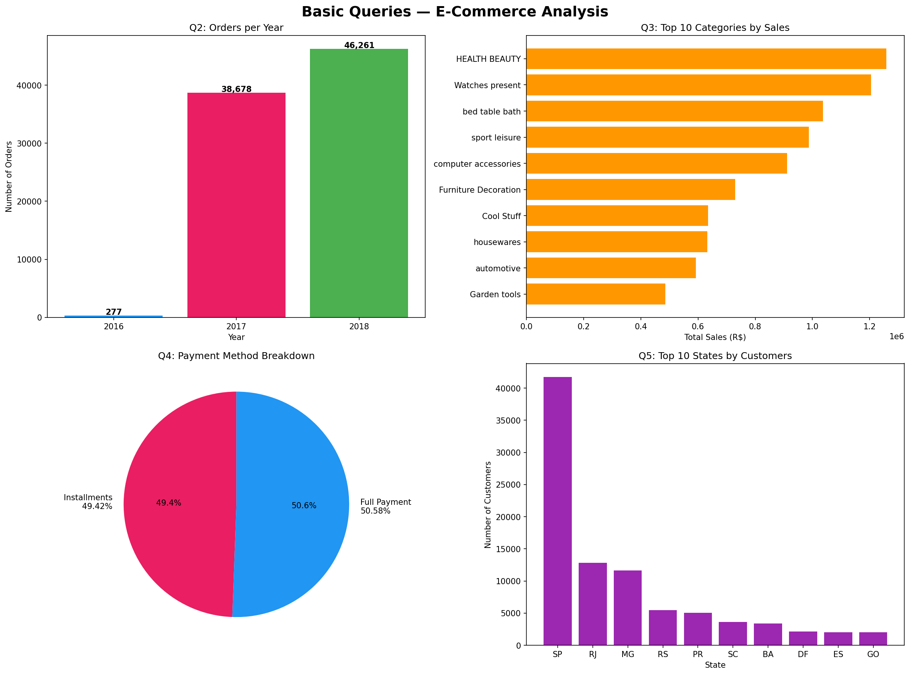
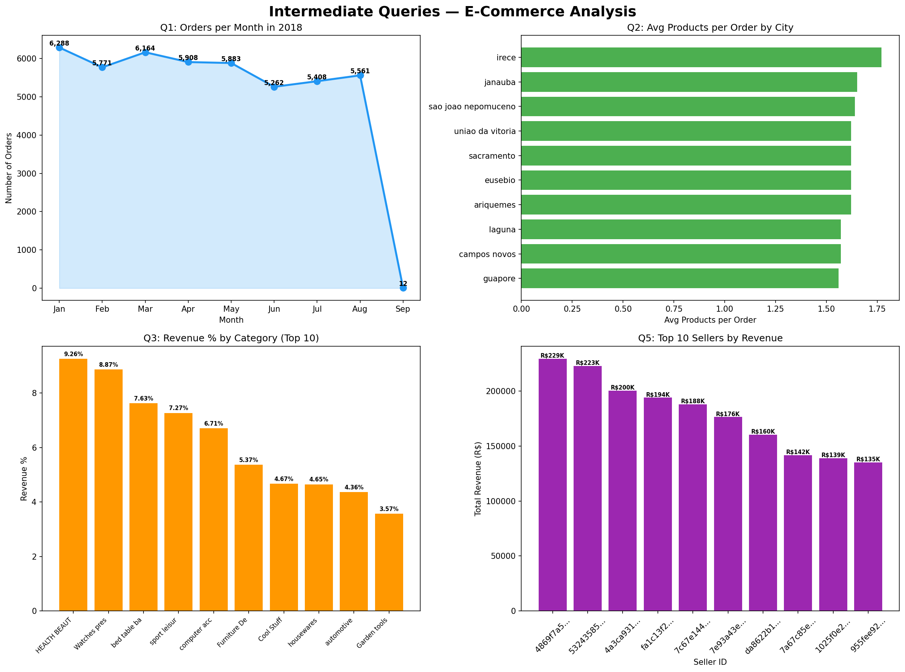
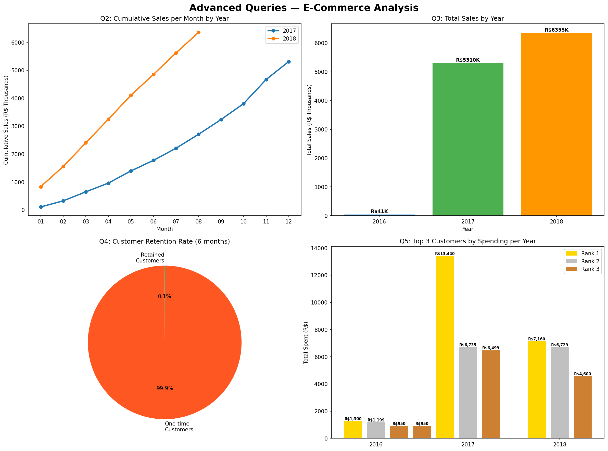

# 🛒 E-Commerce Analysis — SQL & Python Project
>
> Navigating the Future of Online Shopping

## 📌 Project Overview

This project analyzes a Brazilian E-Commerce dataset using **SQL** and **Python**.
It covers Basic, Intermediate, and Advanced query levels with data visualizations
to extract meaningful business insights.

---

## 👤 Project By

- **Name:** Shreyas
- **Tool:** Python, SQLite, Pandas, Matplotlib
- **Platform:** VSCode + Google Colab + GitHub

---

## 📁 Project Structure

🔴 Step 7 — README File

In VSCode → root project folder
New File → name it README.md
Paste this:

markdown# 🛒 E-Commerce Analysis — SQL & Python Project
> Navigating the Future of Online Shopping

## 📌Project Overview

This project analyzes a Brazilian E-Commerce dataset using **SQL** and **Python**.
It covers Basic, Intermediate, and Advanced query levels with data visualizations
to extract meaningful business insights.

---

## 👤Project By

- **Name:** Shreyash
- **Tool:** Python, SQLite, Pandas, Matplotlib
- **Platform:** VSCode + Google Colab + GitHub

---

## 📁Project Structure

ecommerce-sql-python-project/
│
├── data/                         ← All 7 CSV dataset files
│   ├── customers.csv
│   ├── sellers.csv
│   ├── orders.csv
│   ├── order_items.csv
│   ├── payments.csv
│   ├── products.csv
│   └── geolocation.csv
│
├── sql/                          ← Pure SQL query files
│   ├── basic_queries.sql
│   ├── intermediate_queries.sql
│   └── advanced_queries.sql
│
├── notebooks/                    ← Google Colab notebook
│   └── ecommerce_analysis.ipynb
│
├── visuals/                      ← All charts and graphs
│   ├── basic_viz.png
│   ├── intermediate_viz.png
│   └── advanced_viz.png
│
├── setup_db.py
├── run_basic_queries.py
├── run_intermediate_queries.py
├── run_advanced_queries.py
└── README.md

---

## 📊 Dataset Overview

| File | Description | Rows |
| customers.csv | Customer demographic details | 99,441 |
| sellers.csv | Seller information | 3,095 |
| orders.csv | Order history and details | 99,441 |
| order_items.csv | Order items details | 112,650 |
| payments.csv | Payment details | 103,886 |
| products.csv | Product details | 32,951 |
| geolocation.csv | Geolocation details | 1,000,163 |

---

## 🔧 Tools & Libraries

| Tool | Purpose |
| Python 3.x | Core programming language |
| SQLite | Database engine |
| Pandas | Data manipulation |
| Matplotlib | Data visualization |
| Google Colab | Notebook environment |
| VSCode | Code editor |
| GitHub | Version control |

---

## 📝 How to Run

### 1. Clone the repository

```bash
git clone https://github.com/YOUR_USERNAME/ecommerce-sql-python-project.git
cd ecommerce-sql-python-project
```

### 2. Install dependencies

```bash
pip install pandas matplotlib openpyxl seaborn
```

### 3. Setup database

```bash
python setup_db.py
```

### 4. Run queries

```bash
python run_basic_queries.py
python run_intermediate_queries.py
python run_advanced_queries.py
```

### 5. Run visualizations

```bash
python basic_viz.py
python intermediate_viz.py
python advanced_viz.py
```

---

## 📊 BASIC QUERIES
>
> Objective: Extract fundamental insights from the dataset.

| # | Query | Result |
| Q1 | Unique cities where customers are located | **4,119 unique cities** |
| Q2 | Number of orders placed in 2017 | **45,101 orders** |
| Q3 | Total sales per category | **Health & Beauty — R$1.25M** |
| Q4 | Percentage of orders paid in installments | **49.42%** |
| Q5 | Number of customers from each state | **SP leads with 41,746** |

### 📈 Basic Queries Visualization



---

## 📊 INTERMEDIATE QUERIES
>
> Objective: Dive deeper into sales and order trends.

| # | Query | Result |
| Q1 | Orders per month in 2018 | **January peak — 6,288 orders** |
| Q2 | Avg products per order by city | **Padre Carvalho — 7 products/order** |
| Q3 | Revenue % by product category | **Health & Beauty — 9.26%** |
| Q4 | Price vs purchase frequency | **Most purchased product — 527 times** |
| Q5 | Total revenue by seller ranked | **Top seller — R$2,29,472** |

### 📈 Intermediate Queries Visualization



---

## 📊 ADVANCED QUERIES
>
> Objective: Generate strategic and customer-centric insights.

| # | Query | Result |
| Q1 | Moving average of order values | Tracks customer spending trends |
| Q2 | Cumulative sales per month | **2018 hit R$6.35M by August** |
| Q3 | Year-over-year growth rate | **2017 grew 12,745% vs 2016!** |
| Q4 | Customer retention rate | **0% — most buy only once** |
| Q5 | Top 3 customers per year | **2017 top spender — R$13,440** |

### 📈 Advanced Queries Visualization



---

## 💡 Key Business Insights

1. **São Paulo dominates** — SP state has 42% of all customers
2. **Health & Beauty is top category** — R$1.25M in total sales
3. **Half of customers pay in installments** — 49.42% use installment plans
4. **Massive growth in 2017** — Business grew 12,745% compared to 2016
5. **Low retention rate** — Most customers purchase only once, suggesting need for loyalty programs
6. **Seasonal peaks** — November 2017 had highest monthly sales (R$863K) likely due to Black Friday

---

## 📓 Google Colab Notebook

All SQL queries and Python visualizations are available in the Colab notebook:
📔 [Open in Google Colab](notebooks/ecommerce_analysis.ipynb)
